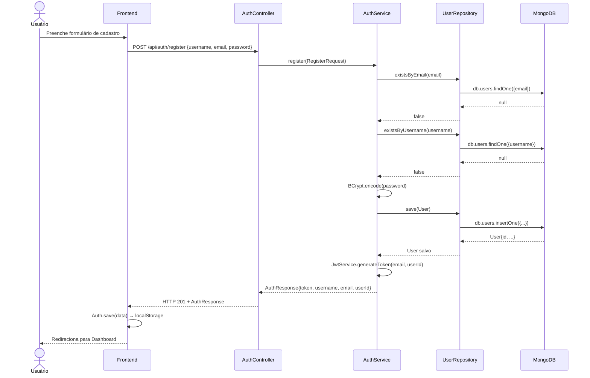
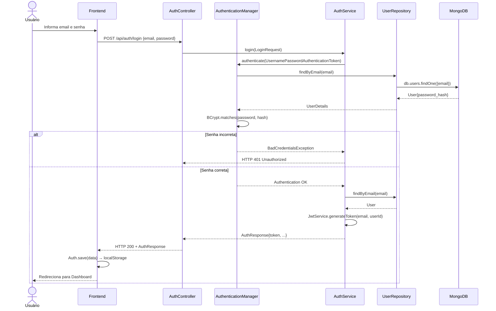
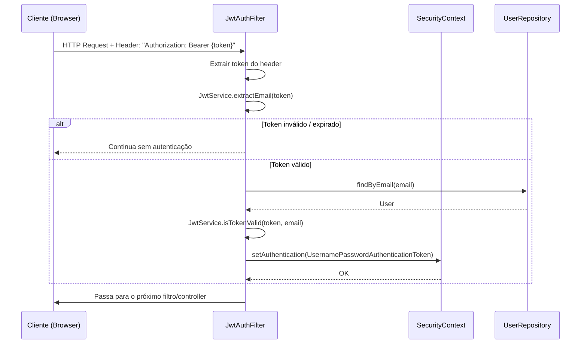
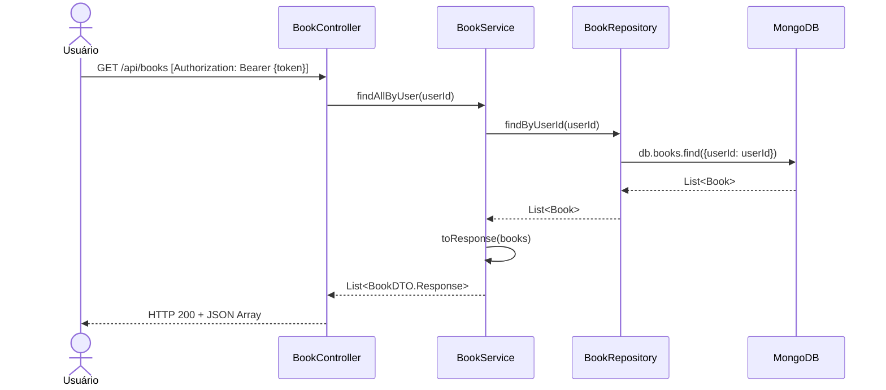
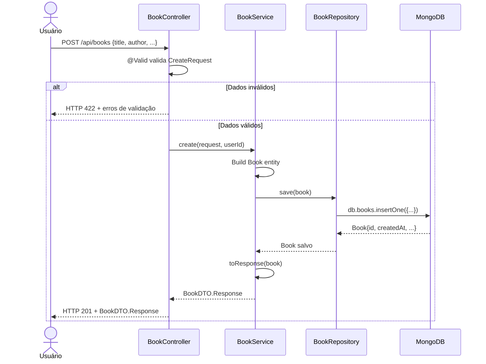
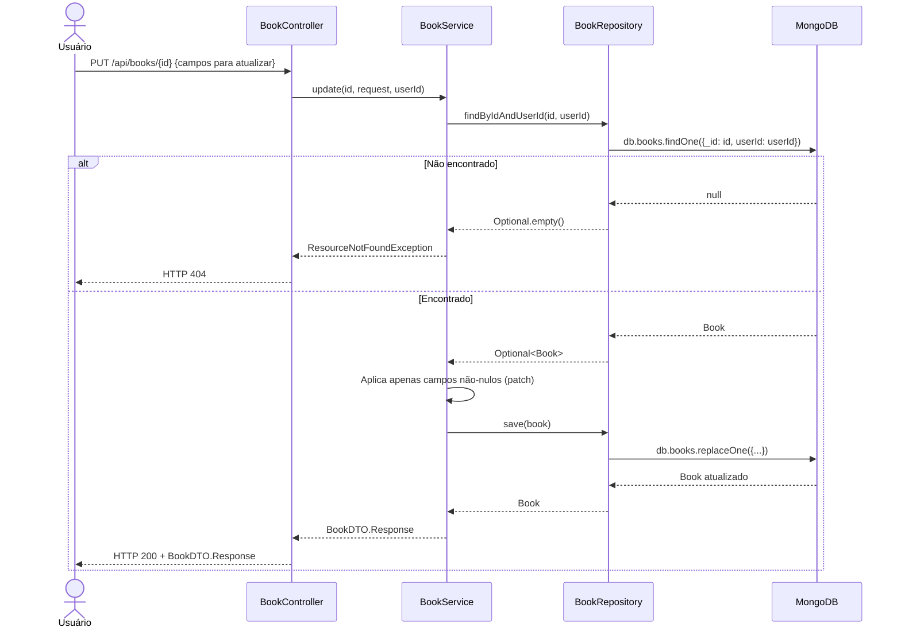
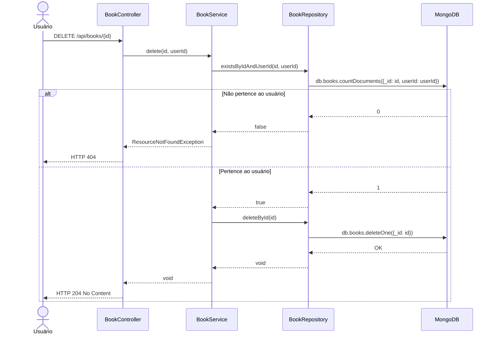
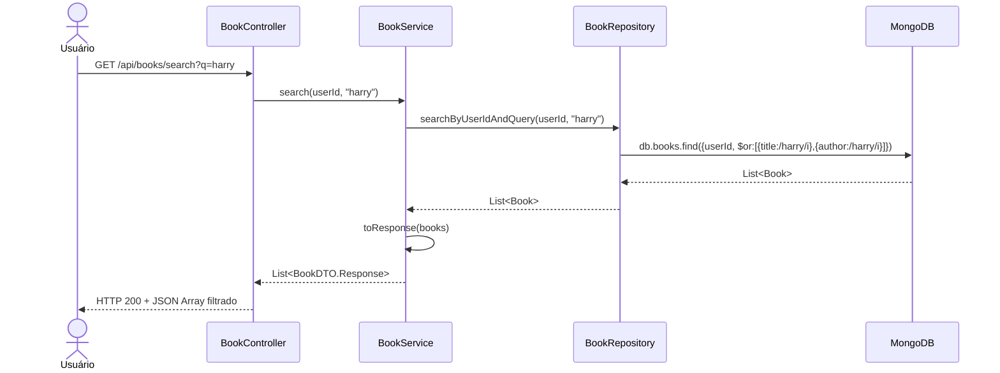
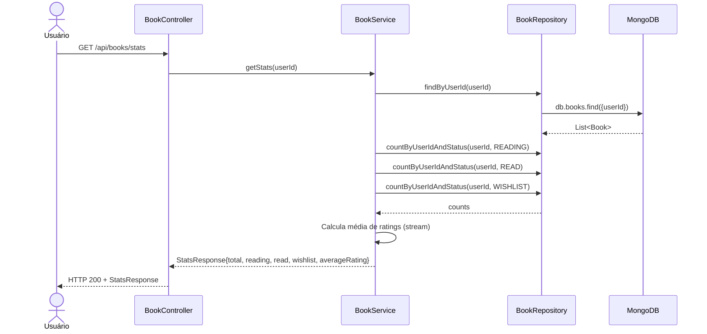
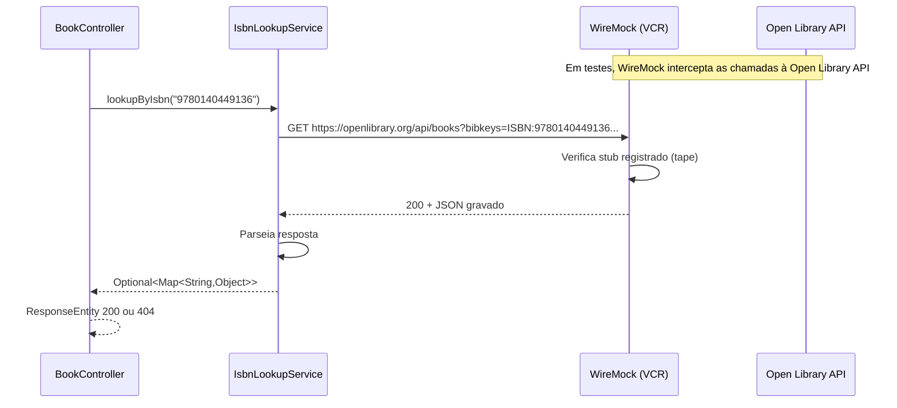

# RTM — Matriz de Rastreabilidade de Requisitos

**Projeto:** Gerenciador de Biblioteca Pessoal  
**Versão:** 1.0.0  
**Cobertura:** 100% dos requisitos funcionais mapeados

---

## Legenda de Status

| Símbolo | Significado |
|---|---|
| ✅ | Implementado e testado |
| 🧪 | Testado |
| 📋 | Mapeado |

---

## RF-001 — Cadastro de Usuário

**Descrição:** O sistema deve permitir que um novo usuário se cadastre fornecendo username, email e senha.

**Endpoint:** `POST /api/auth/register`

### Casos de Teste

| ID do Teste | Tipo | Classe | Método | Cenário |
|---|---|---|---|---|
| TC-001-1 | Unitário (Caixa Branca) | `AuthServiceTest` | `register_validRequest_returnsJwt` | Cadastro válido retorna JWT |
| TC-001-2 | Unitário (Caixa Branca) | `AuthServiceTest` | `register_duplicateEmail_throwsException` | Email duplicado lança exceção |
| TC-001-3 | Unitário (Caixa Branca) | `AuthServiceTest` | `register_duplicateUsername_throwsException` | Username duplicado lança exceção |
| TC-001-4 | Unitário (Caixa Branca) | `AuthServiceTest` | `register_password_isStoredAsHash` | Senha armazenada como BCrypt |
| TC-001-5 | Parametrizado | `AuthServiceTest` | `register_defaultRole_isUser` | Role USER atribuído por padrão (3 emails) |
| TC-001-6 | E2E (Caixa Preta) | `AuthControllerTest` | `register_validData_returns201` | HTTP 201 com dados válidos |
| TC-001-7 | E2E (Caixa Preta) | `AuthControllerTest` | `register_duplicateEmail_returns409` | HTTP 409 para email duplicado |
| TC-001-8 | E2E Parametrizado | `AuthControllerTest` | `register_invalidFields_returns422` | HTTP 422 para campos inválidos (3 cenários) |

### Diagrama UML de Sequência

---

## RF-002 — Autenticação (Login)

**Descrição:** O sistema deve permitir que um usuário cadastrado faça login com email e senha, recebendo um JWT.

**Endpoint:** `POST /api/auth/login`

### Casos de Teste

| ID do Teste | Tipo | Classe | Método | Cenário |
|---|---|---|---|---|
| TC-002-1 | Unitário (Caixa Branca) | `AuthServiceTest` | `login_validCredentials_returnsJwt` | Login válido retorna JWT |
| TC-002-2 | E2E (Caixa Preta) | `AuthControllerTest` | `login_validCredentials_returns200` | HTTP 200 com credenciais corretas |
| TC-002-3 | E2E (Caixa Preta) | `AuthControllerTest` | `login_wrongPassword_returns401` | HTTP 401 com senha incorreta |

### Diagrama UML de Sequência

---

## RF-003 — Gerenciamento de Sessão

**Descrição:** O sistema deve manter a sessão do usuário via JWT armazenado no cliente, protegendo as rotas que requerem autenticação.

### Casos de Teste

| ID do Teste | Tipo | Classe | Método | Cenário |
|---|---|---|---|---|
| TC-003-1 | Unitário (Caixa Branca) | `JwtServiceTest` | `generateToken_structure_hasThreeParts` | Token gerado com 3 partes |
| TC-003-2 | Unitário (Caixa Branca) | `JwtServiceTest` | `extractEmail_returnsCorrectEmail` | Extração de email do token |
| TC-003-3 | Unitário (Caixa Branca) | `JwtServiceTest` | `extractUserId_returnsCorrectUserId` | Extração de userId do token |
| TC-003-4 | Unitário (Caixa Branca) | `JwtServiceTest` | `isTokenValid_validToken_returnsTrue` | Token válido retorna true |
| TC-003-5 | Unitário (Caixa Branca) | `JwtServiceTest` | `isTokenValid_wrongEmail_returnsFalse` | Email diferente retorna false |
| TC-003-6 | Parametrizado | `JwtServiceTest` | `generateToken_differentUsers_uniqueTokens` | Tokens únicos por usuário (3 cenários) |
| TC-003-7 | E2E (Caixa Preta) | `AuthControllerTest` | `getMe_validJwt_returns200` | HTTP 200 com JWT válido |
| TC-003-8 | E2E (Caixa Preta) | `AuthControllerTest` | `getMe_noJwt_returns403` | HTTP 403 sem JWT |

### Diagrama UML de Sequência

---

## RF-004 — Listar Livros

**Descrição:** O usuário autenticado deve visualizar todos os seus livros cadastrados.

**Endpoint:** `GET /api/books`

### Casos de Teste

| ID do Teste | Tipo | Classe | Método | Cenário |
|---|---|---|---|---|
| TC-004-1 | Unitário (Caixa Branca) | `BookServiceTest` | `findAllByUser_userIsolation` | Retorna somente livros do usuário |
| TC-004-2 | Integração | `BookRepositoryIntegrationTest` | `findByUserId_returnsOnlyUserBooks` | Isolamento no repositório |
| TC-004-3 | E2E (Caixa Preta) | `BookControllerTest` | `listBooks_newUser_returnsEmptyList` | HTTP 200 e lista vazia |
| TC-004-4 | E2E (Caixa Preta) | `BookControllerTest` | `listBooks_returnsOnlyUserBooks` | Isolamento entre usuários |

### Diagrama UML de Sequência

---

## RF-005 — Criar Livro

**Descrição:** O usuário autenticado deve poder cadastrar um novo livro com título, autor e demais campos opcionais.

**Endpoint:** `POST /api/books`

### Casos de Teste

| ID do Teste | Tipo | Classe | Método | Cenário |
|---|---|---|---|---|
| TC-005-1 | Unitário (Caixa Branca) | `BookServiceTest` | `create_defaultStatus_isWishlist` | Status WISHLIST por padrão |
| TC-005-2 | Parametrizado | `BookServiceTest` | `create_allStatuses` | Aceita todos os status (3 cenários) |
| TC-005-3 | Parametrizado | `BookServiceTest` | `create_validRatings` | Aceita ratings 1-5 (5 cenários) |
| TC-005-4 | E2E (Caixa Preta) | `BookControllerTest` | `createBook_valid_returns201` | HTTP 201 com dados válidos |
| TC-005-5 | E2E (Caixa Preta) | `BookControllerTest` | `createBook_noToken_returns401` | HTTP 403 sem token |
| TC-005-6 | E2E Parametrizado | `BookControllerTest` | `createBook_missingFields_returns422` | HTTP 422 para campos ausentes (3 cenários) |

### Diagrama UML de Sequência

---

## RF-006 — Atualizar Livro

**Descrição:** O usuário deve poder atualizar os dados de um livro existente (patch parcial).

**Endpoint:** `PUT /api/books/{id}`

### Casos de Teste

| ID do Teste | Tipo | Classe | Método | Cenário |
|---|---|---|---|---|
| TC-006-1 | Unitário (Caixa Branca) | `BookServiceTest` | `update_partialPatch_onlyNonNullFields` | Atualiza somente campos enviados |
| TC-006-2 | E2E (Caixa Preta) | `BookControllerTest` | `updateBook_valid_returns200` | HTTP 200 ao atualizar |

### Diagrama UML de Sequência

---

## RF-007 — Excluir Livro

**Descrição:** O usuário deve poder excluir um livro da sua biblioteca.

**Endpoint:** `DELETE /api/books/{id}`

### Casos de Teste

| ID do Teste | Tipo | Classe | Método | Cenário |
|---|---|---|---|---|
| TC-007-1 | Unitário (Caixa Branca) | `BookServiceTest` | `delete_otherUserBook_throwsException` | Não permite excluir livro de outro usuário |
| TC-007-2 | E2E (Caixa Preta) | `BookControllerTest` | `deleteBook_existing_returns204` | HTTP 204 ao excluir |
| TC-007-3 | E2E (Caixa Preta) | `BookControllerTest` | `deleteBook_otherUser_returns404` | HTTP 404 para livro de outro usuário |

### Diagrama UML de Sequência

---

## RF-008 — Buscar Livros

**Descrição:** O usuário deve poder buscar livros por título ou autor (case-insensitive).

**Endpoint:** `GET /api/books/search?q={query}`

### Casos de Teste

| ID do Teste | Tipo | Classe | Método | Cenário |
|---|---|---|---|---|
| TC-008-1 | Unitário (Caixa Branca) | `BookServiceTest` | `search_titleAndAuthor_caseInsensitive` | Busca por título e autor |
| TC-008-2 | Integração Parametrizado | `BookRepositoryIntegrationTest` | `searchByUserIdAndQuery_findsResults` | 4 cenários de busca (query, resultado esperado) |
| TC-008-3 | E2E (Caixa Preta) | `BookControllerTest` | `search_returnsFilteredBooks` | HTTP 200 com resultados filtrados |

### Diagrama UML de Sequência

---

## RF-009 — Estatísticas Pessoais

**Descrição:** O usuário deve visualizar estatísticas da sua biblioteca (totais por status e média de avaliação).

**Endpoint:** `GET /api/books/stats`

### Casos de Teste

| ID do Teste | Tipo | Classe | Método | Cenário |
|---|---|---|---|---|
| TC-009-1 | Unitário (Caixa Branca) | `BookServiceTest` | `getStats_averageRating_correct` | Cálculo correto de média |
| TC-009-2 | Unitário (Caixa Branca) | `BookServiceTest` | `getStats_noRatings_averageIsZero` | Média 0.0 sem avaliações |
| TC-009-3 | Integração Parametrizado | `BookRepositoryIntegrationTest` | `findByUserIdAndStatus_filters` | Filtro por status (3 cenários) |
| TC-009-4 | Integração | `BookRepositoryIntegrationTest` | `countByUserIdAndStatus_correctCounts` | Contagem por status |
| TC-009-5 | E2E (Caixa Preta) | `BookControllerTest` | `getStats_returnsCorrectData` | HTTP 200 com dados corretos |

### Diagrama UML de Sequência

---

## RF-010 — Lookup de ISBN via API Externa (VCR)

**Descrição:** O sistema deve consultar a Open Library API para buscar metadados de livros por ISBN.

**Endpoint:** `GET /api/books/isbn/{isbn}`

### Casos de Teste

| ID do Teste | Tipo | Classe | Método | Cenário |
|---|---|---|---|---|
| TC-010-1 | VCR (WireMock) | `IsbnLookupVcrTest` | `lookupByIsbn_found_returnsData` | ISBN encontrado retorna dados (tape: 9780140449136) |
| TC-010-2 | VCR (WireMock) | `IsbnLookupVcrTest` | `lookupByIsbn_notFound_returnsEmpty` | ISBN não encontrado retorna vazio |
| TC-010-3 | VCR (WireMock) | `IsbnLookupVcrTest` | `lookupByIsbn_serverError_returnsEmpty` | Erro 500 da API retorna vazio |
| TC-010-4 | VCR Parametrizado | `IsbnLookupVcrTest` | `lookupByIsbn_multipleIsbns` | Múltiplos ISBNs (2 tapes parametrizadas) |

### Diagrama UML de Sequência

---

## Resumo de Cobertura RTM

| Requisito | Total de Testes | Unitários | Integração | E2E | VCR | Parametrizados |
|---|---|---|---|---|---|---|
| RF-001 Cadastro | 8 | 5 | 0 | 3 | 0 | 2 |
| RF-002 Login | 3 | 1 | 0 | 2 | 0 | 0 |
| RF-003 Sessão/JWT | 8 | 6 | 0 | 2 | 0 | 1 |
| RF-004 Listar Livros | 4 | 1 | 1 | 2 | 0 | 0 |
| RF-005 Criar Livro | 6 | 3 | 0 | 3 | 0 | 3 |
| RF-006 Atualizar | 2 | 1 | 0 | 1 | 0 | 0 |
| RF-007 Excluir | 3 | 1 | 0 | 2 | 0 | 0 |
| RF-008 Buscar | 3 | 1 | 1 | 1 | 0 | 1 |
| RF-009 Estatísticas | 5 | 2 | 2 | 1 | 0 | 1 |
| RF-010 ISBN/VCR | 4 | 0 | 0 | 0 | 4 | 1 |
| **TOTAL** | **46** | **21** | **4** | **17** | **4** | **9** |

> ✅ **100% dos requisitos funcionais possuem testes mapeados.**  
> ✅ **Zero mocks** — todos os testes de persistência usam Testcontainers MongoDB.  
> ✅ **VCR** — chamadas HTTP externas gravadas com WireMock.
